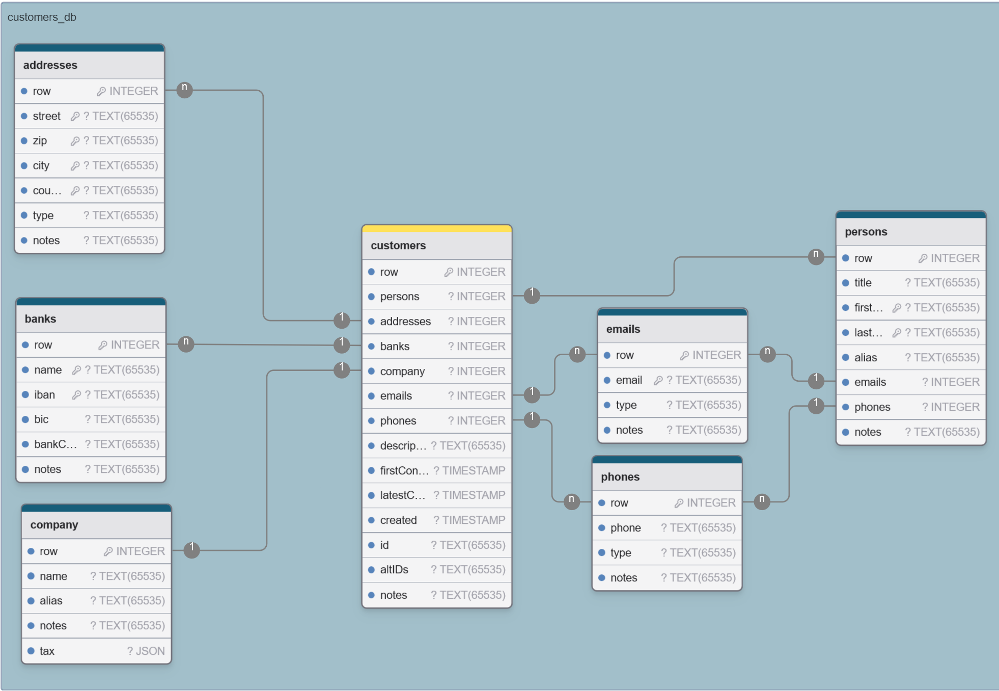

# Contributions

Anyone can contribute. This is not a Pet-Project nor do I follow any agenda with this repo. So I'm happy to accept any contributions. As long as it fits in I have no objections. I hope this goes without saying, but make sure to be verbose while messaging. This minimizes all the guessing work one might have to do.

- [Getting Started](#getting-started)
- [Workspace](#workspace)
	- [Yarn Package Manager](#yarn-package-manager)
	- [Environment Variables](#environment-variables)
- [React Dev Tools](#react-devtools)
- [Theming](#theming)
- [Data Storage](#data-storage)
	- [File Storage](#file-storage)
	- [IndexedDB](#indexeddb)
		- [factor_db](#factor_db)
  		- [customers_db](#customers_db)
  		- [articles_db](#articles_db)
  		- [documents_db](#documents_db)
	- [Local Storage](#local-storage)
	- [Session Storage](#session-storage)
- [Sample Data](#sample-data)
- [Build](#build)

## Getting Started

Prerequisites:
- [nmv](https://www.freecodecamp.org/news/node-version-manager-nvm-install-guide/) or other Node.js version management tool
- [Node.js](https://nodejs.org/en) Long Term Support version
- [git](https://git-scm.com/)
- [Rust toolchain](https://www.rust-lang.org/learn/get-started)
- [... more OS specific installs](https://v2.tauri.app/start/prerequisites/)

```bash
nvm install lts
nvm use lts
corepack enable
git clone https://github.com/39zde/factor.git
cd factor
yarn install
yarn dev
```

## Workspace

Some files are hidden by default in [`factor.code-workspace`](./factor.code-workspace). Development so far happened in [VSCodium](https://github.com/VSCodium/vscodium). You may choose whatever IDE you like.

 ### Yarn Package Manager

To use yarn the official way [corepack](https://nodejs.org/api/corepack.html) must be enabled. Follow [this](https://yarnpkg.com/getting-started/install) instruction guide to get started.

 ### Environment Variables
	set ESLINT_USE_FLAT_CONFIG=true as as system environment variable

## React Devtools

Run
```bash
npm install -g react-devtools
yarn devtools
```
and uncomment
```html
<script src="http://localhost:8097"></script>
```
in [index.html](./index.html)

## Theming

Theming is done via the [light-dark](https://developer.mozilla.org/en-US/docs/Web/CSS/color_value/light-dark) CSS color function. The theme is then being changed by setting a different `color-scheme` value in a CSS root tag. Try to follow the general styling.


## Data Storage

The app uses multiple storage methods. Here are the ones we will use and what purpose they serve, and how important each on is.
Ratings:
 - High: Very important data. Treat very carefully.
 - Medium: The App does need it to function properly, but a loss of the data is not a big deal. Will stop the information flow, if broken.
 - Low: The App function fine without this data it, but looses some convenience features.

 ### File Storage

  The App saves the it's settings as a json file. The reason for doing so is user/system accessibility and persistence between reinstalls. The AppSettings are being saved at the $APPCONFIG/settings.json file, to persist values between restarts and install. Check the [Tauri Docs](https://v2.tauri.app/reference/javascript/fs/) for more.<br>
  _Rating: Medium_

 ### IndexedDB
 ---
  This app utilizes more than one IndexedDB Instance.

  #### factor_db

   Holds application specific data like data uploads and such. This is up for deletion any time, so nothing important should be stored here.<br>
   _Rating: Medium_

  #### customer_db

   Holds the customer data distributes across different oStores.<br>
   _Rating: High_

  #### article_db

   Holds the article data distributed across different oStores.<br>
   _Rating: High_

  #### document_db

   Hold the data of created Documents across different oStores.<br>
   _Rating: High_

 ### Local Storage
 ---

  Saves the columns widths of every column of every table as a comma separated list of floats. Key: `${tableName}-columnWidths`

  Saves the column order of all columns of a table as a comma separated list of strings. Key: `${tableName}-allColumns`

  Saves the visible columns of a table as a comma separated list of strings. Key: `${tableName}-columns`

  _Rating: Low_

## Data Structures

 Here is an Example made with [DrawDB](https://github.com/drawdb-io/drawdb) of the customers_db database. Each "table" is an oStore. `row` is always the keyPath.  The data types don't match entirely. Fields with a key icon are indexed fields, where indexed means [IDBIndex](https://developer.mozilla.org/en-US/docs/Web/API/IDBIndex). Every field, from which a `1->n` connection originates, is of type `ArrayBuffer`. The `ArrayBuffer`, when decoded with `Uint32`, has n = `ArrayBuffer.byteLength` / `2` references. The reference (the `Uint32` number) is then the row number in the other oStore. The other oStore name is always the key. Thats how relations are stored.

 

 Also have a look at [`./src/renderer/src/util/types/database`](./src/renderer/src/util/types/database/)

Index Names have the following structure:
`${oStore}-${keyPath}`


## Sample Data

 There is a way to generate sample data, which is ready for importing. The script is located at [`./resources/data/genData.cli.js`](./resources/data/genData.cli.js).
 ```bash
node genData.cli.js
 ```
 After calling the script you will be asked, how many rows you want. Shortly after a file will appear, ready to be used.

## Build

```bash
yarn build
```
This command does the trick. For further details consult the official docs. Also keep in mind [Tauri v2](https://v2.tauri.app/) is very young
