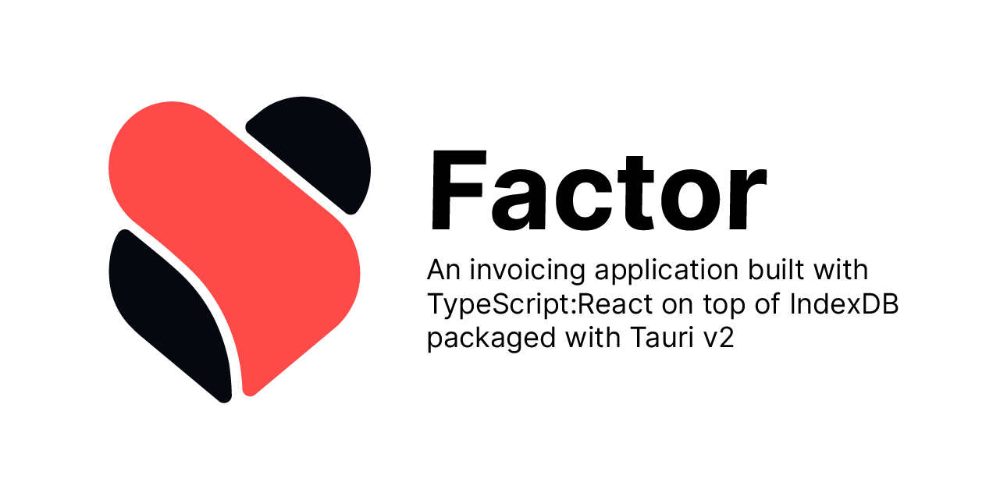
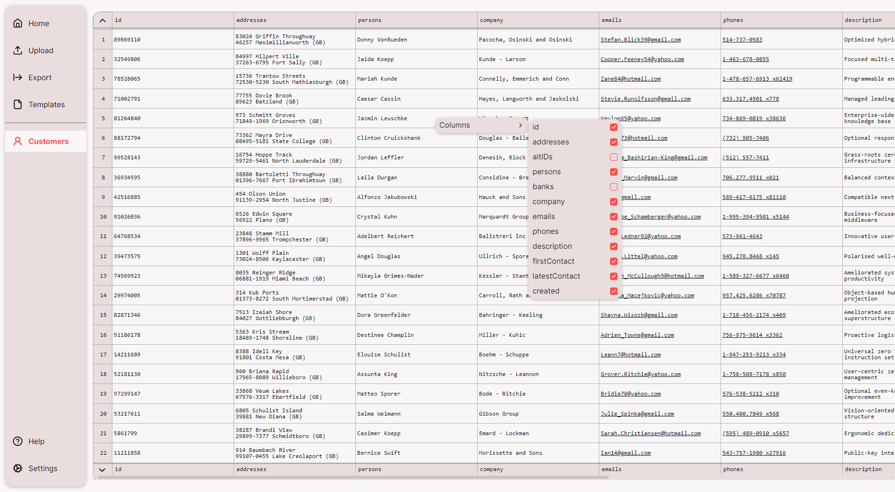
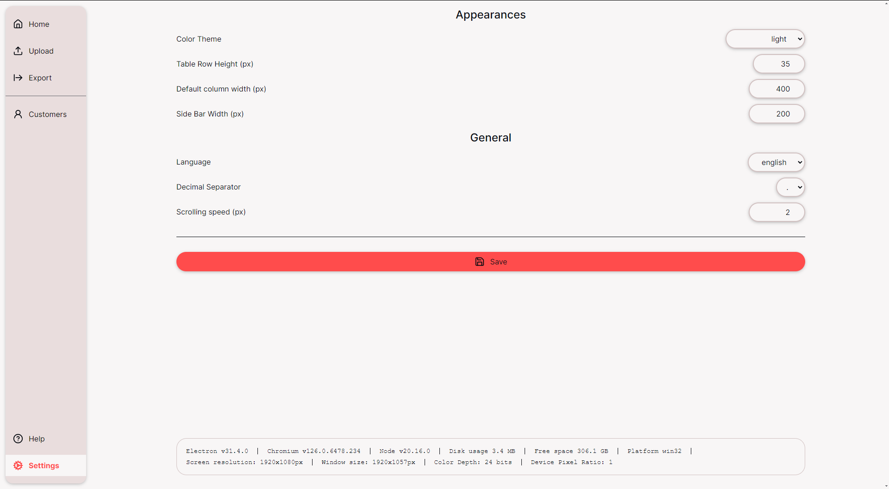
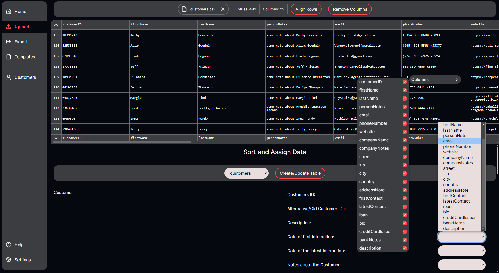

# Factor



An invoicing application built with TypeScript:React on top of IndexDB packaged with Tauri v2[^1]

## Status
The most important step is already done, which is the Table Component in in `./src/comps/Table`.
The approach of using IndexedDB is surprisingly performant, better than expected. So why go with IndexedDB?
Well it is already built into the browser, meaning no added dependencies. It's also quite performant, even with
 - IndexedDB is a NOSQL-type Database[^2], but using referencing to different object stores[^3] (oStores)
 - the awkward async callbacks without using `await`
 - no significant performance tricks applied

I have not run any benchmarks yet, but scrolling in a Table with:
 - entries: 4000+ entries
 - scope: 27
 - scrolling speed: 27 per scroll
 - column-count: 12 columns
 - column with of 250px
 - 5 dereferencing operations per row
 - in dev mode
 - on old hardware

works without problems. WebWorkers[^4] do most of the heavy lifting. Certainly more performant, than using `useLiveQuery` from Dexie.js[^5]. That being said there is much more performance to be gained at various places. Looking at what already is accomplished, this approach looks very promising. With this in mind, if the only goal was performance, React would not be the best choice. To my understanding the purpose of React is to make the development easy and comprehensible, not to archive the best possible performance.

For now the uploading of data can only be done in csv with semi-colon (;) separated fields with customers as the only upload option. There are still a bunch of things to do (see [roadmap.md](./roadmap.md)), before adding new tables.

Now this app uses Tauri v2, instead of Electron, for better IPC/File-Handling. Also the Executable Size decreased darmatically, by using the native WebView used on the System.
There are also some major performance gains everywhere, which is really nice to see. Tauri v2 is quite young, so some bugs will be expected, but adopting v2 this early should pay off in the future by not having to migrate from v1.

## Screen Shots






## Quick Start

Prerequisites:
- nmv[^6] or other Node.js[^7] version management tool
- Node.js[^7] Long Term Support version
- git[^8]
- Rust toolchain[^9]

```bash
nvm install lts
nvm use lts
corepack enable
git clone https://github.com/39zde/factor.git
cd factor
yarn install
yarn dev
```
see [`CONTRIBUTING.md`](./CONTRIBUTING.md) for more information

# Links
 [^1]: https://v2.tauri.app/
 [^2]: https://developer.mozilla.org/en-US/docs/Web/API/IndexedDB_API/Basic_Terminology#key_characteristics
 [^3]: https://developer.mozilla.org/en-US/docs/Web/API/IDBObjectStore
 [^4]: https://developer.mozilla.org/en-US/docs/Web/API/Worker/Worker
 [^5]: https://developer.mozilla.org/en-US/docs/Web/API/Worker/Worker
 [^6]: https://github.com/nvm-sh/nvm
 [^7]: https://nodejs.org/
 [^8]: https://git-scm.com/
 [^9]: https://www.rust-lang.org/learn/get-started
